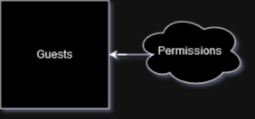

# Guests Table



## Summary
This table is how Pogly Standalone keeps tracks of currently connected users. There are no permanent guest records, or user accounts in Pogly Standalone. Instead, Pogly Standalone relies on a SpacetimeDB concept, [Identity](https://spacetimedb.com/docs#identities). While a guest may use the same token and connect with the same identity, they will be inserted into the guest table as a new guest every time. Pogly Standalone has some localStorage functionality to smooth this out. There is also a Permissions table, which is a supporting table that provides some permissions functionality for things like [Strict Mode](../use/strictMode.md).

## Table Structure
```csharp
[SpacetimeDB.Table(Public = true)]
public partial struct Guests
{
    [SpacetimeDB.Column(ColumnAttrs.PrimaryKey)]
    public Identity Identity;               // PrimaryKey Identifier & Guests public Identity

    public string Nickname;                 // The client-selected nickname for this session
    public string Color;                    // A random color for this session
    public uint SelectedElementId;          // The guests currently selected, or last selected element

    public int PositionX;                   // The posX of a Guests cursor in relation to the canvas
    public int PositionY;                   // The posY of a Guests cursor in relation to the canvas

    public bool Authenticated;              // Has this guest Authenticated? 
}

////////////////////////////
// Permissions Helper Table

[SpacetimeDB.Table(Public = true)]
public partial struct Permissions
{
    [SpacetimeDB.Column(ColumnAttrs.PrimaryKey)]
    public Identity Identity;                   // PrimaryKey Identifier

    public PermissionLevel PermissionLevel;     // PermissionLevel enum
}

[SpacetimeDB.Type]
public enum PermissionLevel
{
    None,               // Unused
    Editor,             // Unused
    Moderator,          // Used for Strict Mode
    Owner               // Used to Identify Owner & in Strict Mode
}
```
This table structure is the most subject to change. There are many things we aren't happy about with this table, and will likely be reworking Authentication, Strict Mode, and overall permissions sometime in the future.

If you plan on modifying the Pogly Standalone client-side, be sure to check the table-structure hasn't changed, and regenerate the client-side bindings if needed.

## Reducers
Unlike most Pogly tables, the Guests table's insert and deletions are handled by the server directly, thus there are no reducers for those operations. Instead, you will primarily find reducers around updating a Guest or permission here.

```csharp
void UpdateGuest(string nickname, uint selectedElementId, int positionX, int positionY) {}

void UpdateGuestNickname(string nickname) {}

void UpdateGuestSelectedElement(uint selectedElementId) {} 

void UpdateGuestPosition(int positionX, int positionY) {}

void SetIdentityPermission(Identity identity, PermissionLevel permissionLevel) {}

void SetIdentityPermissionModerator(Identity identity) {}

void SetIdentityPermissionEditor(Identity identity) {}

void ClearIdentityPermission(Identity identity) {}
```

Unlike the Elements and ElementData tables, the guests table only allows a Guest to modify themselves, as the reducer does not take in a Guest identity as a parameter. This safeguards users from being impersonated or actions to be done on their behalf. 

As with all reducers in Pogly, each reducer must sanity check the input and determine if the reducer should proceed or not. The reducers in the second half, revolving around Permissions, are all restricted to the Owner. These reducers look up the Owners identity, and if the caller is not the owner, the reducer simply rejects and returns out. 

The permissions reducers are used to grant additional permissions to guests during [Strict Mode](../use/strictMode.md). Again, these reducers can only be ran by the owner.

The logic within each reducer is fully customizeable and you are more than able to modify and adjust code as needed to suit your specific needs or purpose. There are various helper functions for Authentication and Strict Mode, as you will see when you start diving into the code. 