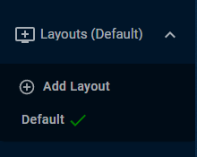
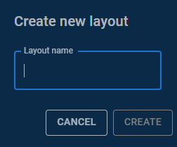
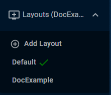
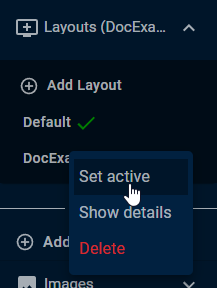
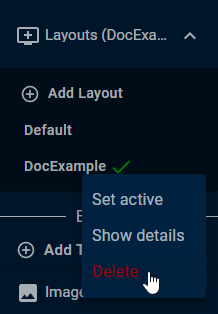

# Layouts

## Summary

Layouts are a great way to keep your Pogly instance organized. Think of them as your OBS scenes, but within Pogly.

## Creating layouts

Every Pogly instances comes with a Default layout. This layout cannot be deleted and will be created automatically. Within the layouts menu, you can find "Add Layout" button which allows you to add custom layouts.

When creating a layout, you will be asked to provide a name for the layout. The name can only contain letters and numbers, no special character or spaces allowed. Do note, layout names **are case sensitive**, so if you want to direct your overlay to a specific layout, it has to be written **exactly the same** in the parameter.

Once you've created a new layout, all you need to do is click on it and start populating the new layout!

When you want to display the layout on stream, you can right click on the layout you want to show and select "Set active". You will know what layout is currently active by the green checkmark next to the name. Note: Changing active layout does not select the layout for you or other editors currently connected.

When chaging active layouts, everyone connected to the editor will be prompted with an alert at bottom right of the page that active layout has been changed.

## Deleting layouts

If you have no longer any use for a layout or just want to do some Spring cleaning, you can delete any custom layouts by simple right clicking the layout in the menu and selecting "Delete".

Any elements in the layout will be **permanently deleted**, unless you choose to preserve them.

When deleting a layout, you will be prompted with a confirmation modal. In the modal, there is a checkbox to preserve elements. When checked, a select option will appear that you can use to pick what existing layout you want the elements to be moved to.

If you don't check the preserve elements checkbox, **all elements will be deleted permanently**.

## Overlay

Using layouts on the overlay side is super simple. If you want to give all the power to your editors, you don't have to do anything extra. The Pogly browser source takes a layout parameter `&layout=` which dictates what layout should be shown. If the parameter is not provided, the overlay will base it on the current active layout which can be changed within the editor (Mentioned above).

If you want to manually choose which layout to show, just provide the `&layout=` parameter in the URL with the name of the layout and the overlay will always show that one. Note: Layout name is case sensitive, as mentioned above, so make sure you write it **exactly** the same way it's shown in the editor.

Ability to choose which layout to show, provides great benefit. You can have multiple Pogly browser sources and have them all point towards a different layout so even if your editors are slacking, you can manually just switch between layouts that way. You can also show multiple layouts at the same time by just having multiple sources visible at the same time.

In this example, I have a separate source for automatic layout, which is just the overlay URL without a `&layout=` parameter and 3 different other sources with each one pointing towards a specific layout.

### Example URLs:

Automatic layout (determined by which layout is selected through the editor):

`http://standalone.pogly.gg/overlay?module=...&domain=...&auth=...`

Specific existing layout:

`http://standalone.pogly.gg/overlay?module=...&domain=...&auth=...&layout=DocExample`
