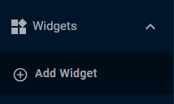
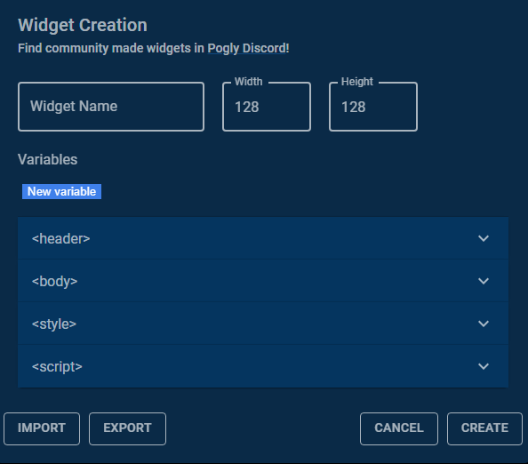
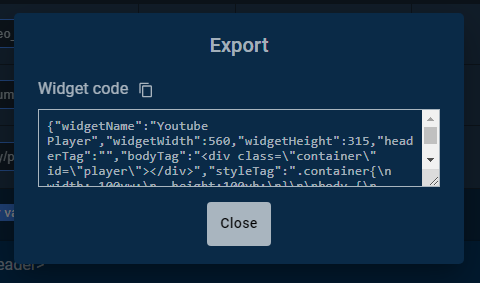
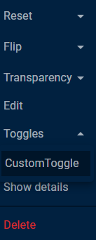
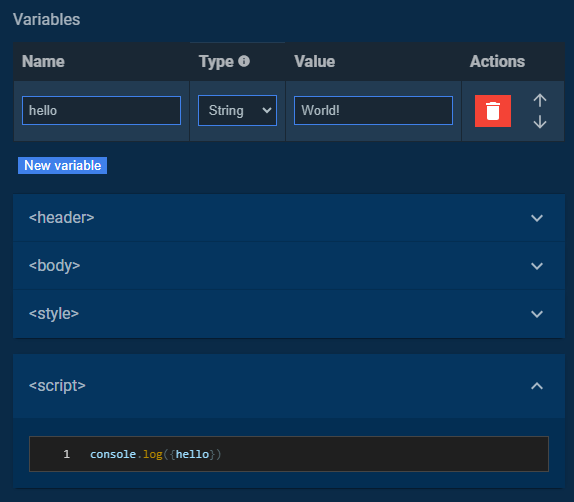

# Widget Element

## Summary

The Widget Element is one of the core canvas elements in Pogly, and the most feature-rich. Widget Elements are essentially mini-websites within Pogly, allowing for unlimited customization and creativity.

If you already know how Widgets work and wish to learn more about making them, scroll down to **Developer Details**!

## Details

Adding a new widget element may take a little practice, especially if you are not familiar with html & javascript. The leftmost menu in Pogly is called the Element Selection Menu. In this menu, you will see the "Widgets" dropdown menu.



Clicking "Add Widget" will result in a new modal appearing, allowing you to program your widget however you see fit.



All the requirements to make a mini-website are present:

- \<header\> => This is the header section of a webpage, you can add script files, css files, etc.
- \<body\> => This is the body or contents of your webpage, you can add divs, paragraphs, links, images, etc.
- \<style\> => This is a built-in css stylesheet which you can add CSS directly to.
- \<script\> => The bread and butter, this allows you to enter javascript to program your widgets functionality.

Included with Pogly Standalone, there are three examples which showcase different widget features and can be used as a starting point if you wish to make your own widget. You can right click->edit the widget when it's on the canvas to peek at the source.

### Importing and exporting

When you've created or edited a widget and wish to share it with someone, pressing export will open up a modal where you can easily copy the code for your widget!



If you'd wish to import an already made Widget, pressing the import button will open a new modal where you can copy paste the widget code that had been exported from somewhere else.


Wondering where you could find community made widgets? Head over to our [Discord](https://discord.gg/uPQsBaVdB7) and browse through our `widget-share` channel!

### Variables

Widget Variables allow you to easily substitute variable names in your widget code. To create a new variable, simply click the `New variable` button and fill the fields.


There are a couple of different variable types:

- string
- boolean
- toggle

String and boolean are pretty self explanatory but toggles are a bit different. While they look and behave exactly like booleans, they have a nifty special feature. When you create a toggle, it will be shown within the Widget element's context menu under "Toggles" submenu and can be triggered from there. They can be used in example to start/stop counters, start Youtube videos, anything you'd want to trigger with a button press.




To use your custom widget variables, all you have to do is reference it in the code in curly brackets in any of the code tabs:



## Developer Details

### Remember, widgets are mostly client-sided!

Widgets are a great way for you to easily extend on Pogly without ever having to touch the source code. Because widgets by default are client-sided, creating something like an interactable button that does effects won't yield the results you're hoping for.

You must develop your widgets with a deterministic mindset. Once a widget spawns, the widget should load and perform the same actions based on the same properties for all clients equally. To aide in that, the `toggle` variable type can be used to "trigger" widgets and it will sync the client-side state of those widgets when toggled.

Keep this client-side / deterministic nature in mind when making your widgets!

### Widget sizing

Due to Widgets actually being just an iframe, getting the widget to be the correct size can be a bit difficult. A sure way to make widget content to be the same size as the actual widget element, consider creating a div container and setting the container width and height to `100vw` and `100vh`. There might still be a little border between the widget content and widget element but you can get rid of that by setting the widget content's `body` margin to 0.

Scaling anything (including text) inside the widget should be done using `vw` and `vh` to make sure the widget content is correct the size both in the editor and overlay. 

If you're feeling lazy, just copy this into your `style` tab.

```
.container{
  width: 100vw;
  height: 100vh;
}

body {
  margin: 0;
}
```

### While( don't! ) {}

Loops are useful and can be used for all sorts of fun stuff but you should be very careful because they might have dire consequences. When creating loops, especially `while` ones, you need to be extra careful that you **do not** make an endless loop. Due to everything running on one thread, an infinite loop can brick the whole Pogly instance and only way to "fix" it, is to completely wipe the SpacetimeDB module.

### Audio playing widgets

If your widget plays audio, make sure who ever is using the overlay has the source on a different audio track in case of DMCA related stuff! 

### Have questions or suggestions?

Feel free to join our [Discord](https://discord.gg/uPQsBaVdB7)!
